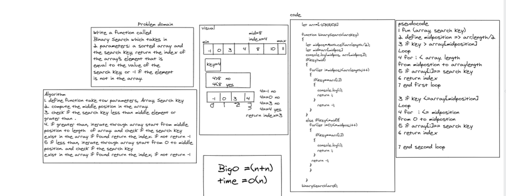

# Reverse an Array
<!-- Description of the challenge -->
Write a function called 
Binary Search which takes in 
2 parameters: a sorted array and 
the search key, return the index of 
the array’s element that is 
equal to the value of the 
search key, or -1 if the element 
is not in the array.

## Whiteboard Process
<!-- Embedded whiteboard image -->

## Approach & Efficiency
<!-- What approach did you take? Discuss Why. What is the Big O space/time for this approach? -->

in this challenge I used tow for loop statements and if statements , to iterate through array ,time complexity of this challenge equal O(n) .