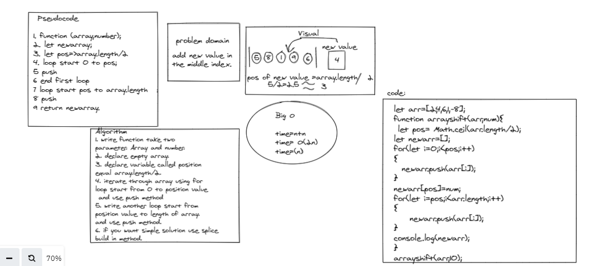

# Reverse an Array
<!-- Description of the challenge -->
 write a  method,the method should add new value in
the middle index.

## Whiteboard Process
<!-- Embedded whiteboard image -->

## Approach & Efficiency
<!-- What approach did you take? Discuss Why. What is the Big O space/time for this approach? -->

in this challenge I used tow for loop statements and push method , to iterate through array ,time complexity of this challenge equal O(n) .

