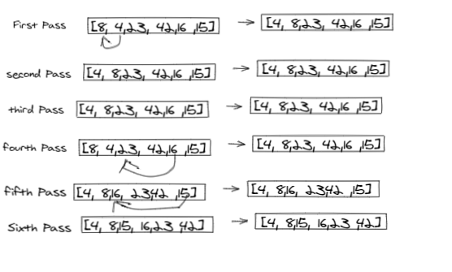
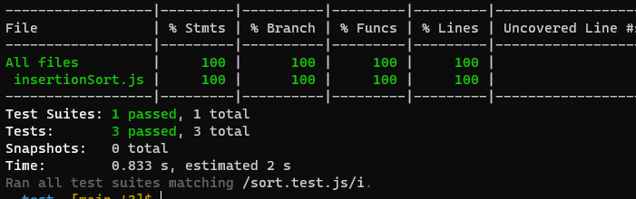

# BLOG

# Insertion Sort

Insertion Sort is one of the simpler sorting algorithms.Insertion Sort takes an array

**Pseudocode**

``` html
  InsertionSort(int[] arr)

    FOR i = 1 to arr.length

      int j <-- i - 1
      int temp <-- arr[i]

      WHILE j >= 0 AND temp < arr[j]
        arr[j + 1] <-- arr[j]
        j <-- j - 1

      arr[j + 1] <-- temp

```

# Trace




1. Pass the unsorted array [8,4,23,42,16,15] into Insertion Sort.

2. Start at the element (4) of the array and compare it with first elemen,(8).
3. Is 4 < 8? Yes, so insert 4 into 8 place => [4,8,23,42,16,15]
4. Now move up to the 3rd element (23) and compare with the value to the left (8).
5. Is 23 < 8? no
6. Now move up to the element (42) and compare with the value to the left (23).
7. Is 42 < 23? No, leave where it is
8. Now move up to the element (16) and compare with the value to the left (42).

Is 16 < 42? Yes
Is 16 < 23? Yes
Is 16 < 8? no

insert 16 after 8

9. Now move up to element (15) and compare with the value to the left (42).

Is 15 < 42? Yes
Is 15 < 23? Yes
Is 15 < 16? yes
Is 15 < 8?no

insert 15 after 8

# BIG O
time complexity of Insertion Sort= O(n^2)

Space complexity of Insertion Sort= O(1)


# Test

npm run test 


