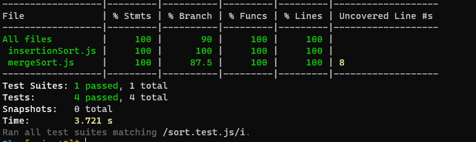

# Merge-Sort


Merge sort is an example of a divide-and-conquer type sorting-algorithm.The input of merge sort is an array of some elements


# Pseudo Code 

```html


ALGORITHM Mergesort(arr)
    DECLARE n <-- arr.length

    if n > 1
      DECLARE mid <-- n/2
      DECLARE left <-- arr[0...mid]
      DECLARE right <-- arr[mid...n]
      // sort the left side
      Mergesort(left)
      // sort the right side
      Mergesort(right)
      // merge the sorted left and right sides together
      Merge(left, right)

ALGORITHM Merge(left, right)
    DECLARE i <-- 0
    DECLARE j <-- 0
    DECLARE k <-- 0

    DECLARE result <-- []

    while i < left.length && j < right.length
        if left[i] < right[j]
            result[k] <-- left[i]
            i <-- i + 1
        else
            result[k] <-- right[j]
            j <-- j + 1

        k <-- k + 1
    while i < left.length
         result[k] <-- left[i]
            i <-- i + 1
             k <-- k + 1

    while j < right.length
            result[k] <-- right[j]
            j <-- j + 1
            k <-- k + 1


```       


Merge sort divides the array in to two sub arrays and later divides each array in to another two arrays and so on until a bunch of single element arrays are left.

 the array [4,7,5,9,1,3,8,2] divides in to single array elements.

# Test




# BIG O
time complexity of merge Sort= O(n log n)

Space complexity of merge Sort= O(n)
 