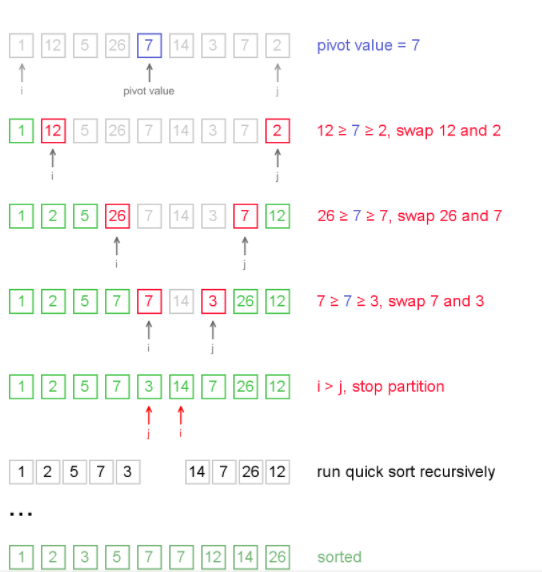
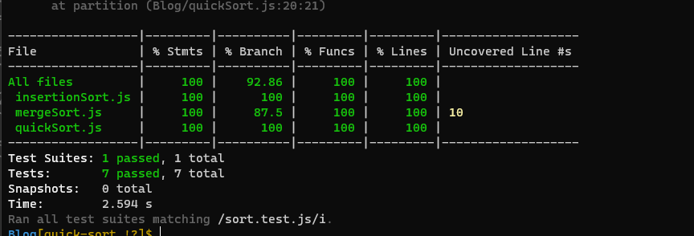

# BLOG

# QuickSort

Quicksort is a sorting algorithm based on the divide and conquer approach where

An array is divided into subarrays by selecting a pivot element (element selected from the array).

While dividing the array, the pivot element should be positioned in such a way that elements less than pivot are kept on the left side and elements greater than pivot are on the right side of the pivot.

# Steps of QuickSort Algorithm

1. find the "pivot" element in the array,determine pivot as middle element
2. left pointer the first element in array.
3. right pointer the last element in array.
4. Compare the left  if it is less than the pivot element, then move the left pointer to the right (add 1 to the left index). Continue this until left side element is greater than or equal to the pivot element.

5. Compare the  right element and if it is greater than the pivot element, then move the right pointer to the left (subtract 1 to the right index). Continue this until right side element is less than or equal to the pivot element.

6. Check if left pointer is less than or equal to right pointer, then swap the elements in locations of these pointers.
7. Increment the left pointer and decrement the right pointer.

8. If index of left pointer is still less than the index of the right pointer, then repeat the process; else return the index of the left pointer.

# Test

# Big O

time complexity of merge Sort= O(n log n)

Space complexity of merge Sort= O(1)

