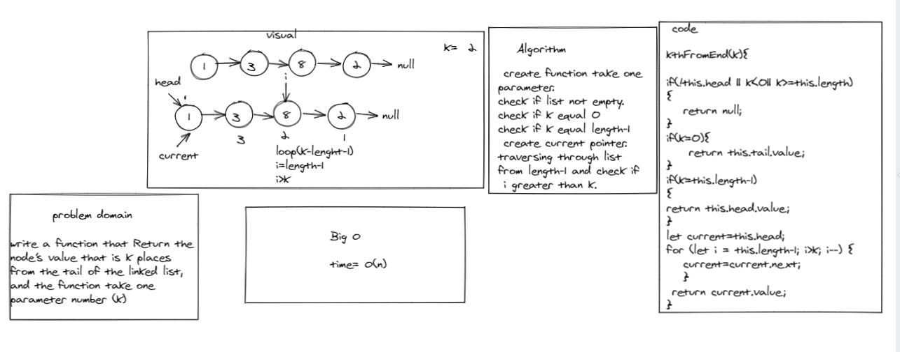

# Singly Linked List

## Challenge
<!-- Description of the challenge -->

KthFromEnd: Return the 
node’s value that is k places 
from the tail of the linked list, 
and the function take one 
parameter number (k)

## Approach & Efficiency
<!-- What approach did you take? Why? What is the Big O space/time for this approach? -->
in linkedlist KthfromEnd method the Big(o) equal n

# test

**tests to prove the following functionality:**

Where k is greater than the length of the linked list

Where k and the length of the list are the same

Where k is not a positive integer

Where the linked list is of a size 1

“Happy Path” where k is not at the end, but somewhere in the middle of the linked list

# whiteBoared

**KthfromEnd**

