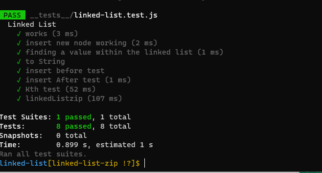
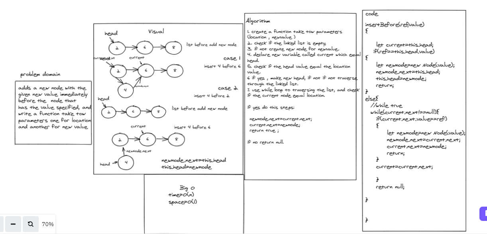
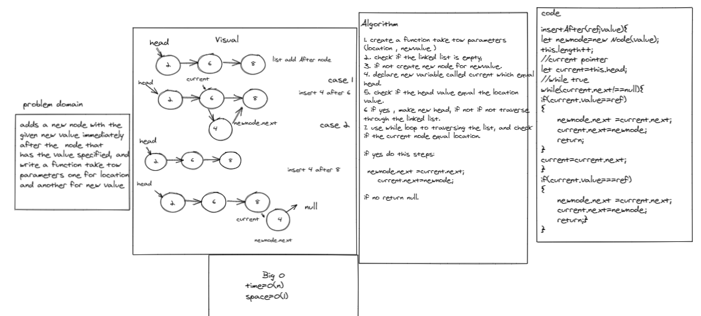

# Linked List Insertions

# Singly Linked List

## Challenge
<!-- Description of the challenge -->
append method : add new node at the end

insert Before: add new node before  specified value specified

insert after: add new node after  specified value specified

## Approach & Efficiency
<!-- What approach did you take? Why? What is the Big O space/time for this approach? -->
in linkedlist Insertion methods the Big(o) equal n

# test

**tests to prove the following functionality:**

* Can successfully add a node to the end of the linked list
* Can successfully add multiple nodes to the end of a linked list
* Can successfully insert a node before a node located i the middle of a linked list
* Can successfully insert a node before the first node of a linked list
* Can successfully insert after a node in the middle of the linked list
* Can successfully insert a node after the last node of the linked list

# whiteBoared

**insert before**

**insert after**

