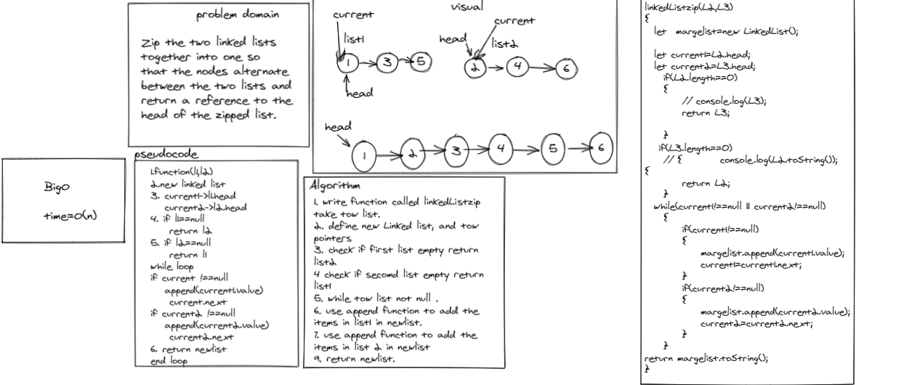
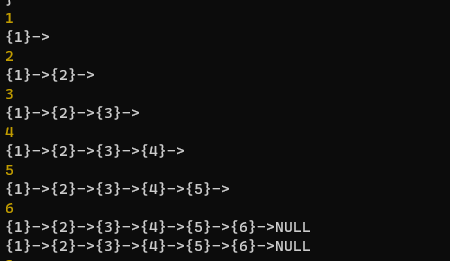

# Singly Linked List

## Challenge
<!-- Description of the challenge -->

Zip the two linked lists 
together into one so 
that the nodes alternate 
between the two lists and 
return a reference to the 
head of the zipped list.

## Approach & Efficiency
<!-- What approach did you take? Why? What is the Big O space/time for this approach? -->
in linkedlistZip method the Big(o) equal n

# test

# whiteBoared

# result

