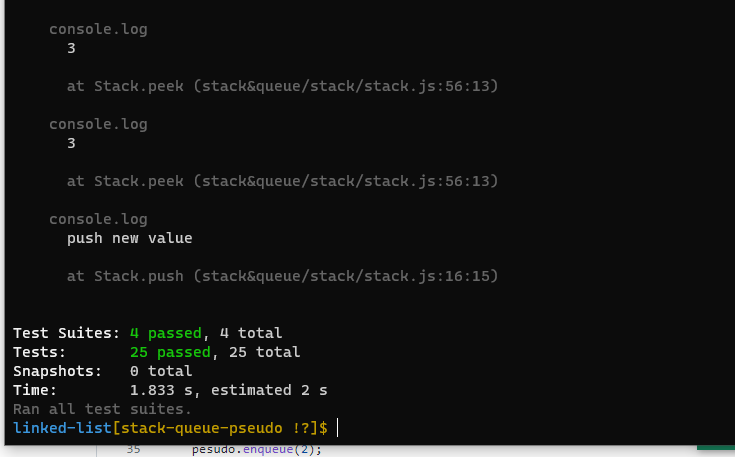
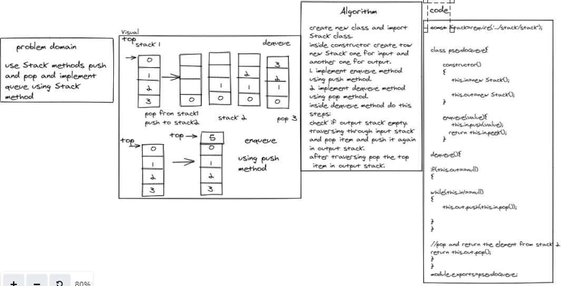

## Challenge

Implement Queue using Stack

**enqueue**

Inserts value into the PseudoQueue, using a first-in, first-out approach.

**dequeue**

Extracts a value from the PseudoQueue, using a first-in, first-out approach.h

# Test

**test npm run test**

# white Boarde

