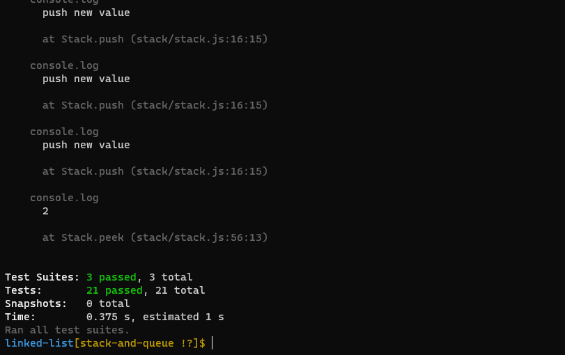

# Stacks and Queues
<!-- Short summary or background information -->

Stack is a container of objects that are inserted and removed according to the last-in first-out (LIFO) principle. Queue is a container of objects (a linear collection) that are inserted and removed according to the first-in first-out (FIFO) principle

## Challenge

create Stack and Queue.

# Test

**test npm run test**

tests to prove the following functionality:

* Can successfully push onto a stack
* Can successfully push multiple values onto a stack
* Can successfully pop off the stack
* Can successfully empty a stack after multiple pops
* Can successfully peek the next item on the stack
* Can successfully instantiate an empty stack
* Calling pop or peek on empty stack raises exception
* Can successfully enqueue into a queue
* Can successfully enqueue multiple values into a queue
* Can successfully dequeue out of a queue the expected value
* Can successfully peek into a queue, seeing the expected value
* Can successfully empty a queue after multiple dequeues
* Can successfully instantiate an empty queue
* Calling dequeue or peek on empty queue raises exception

## Approach & Efficiency
<!-- What approach did you take? Why? What is the Big O space/time for this approach? -->

* time= O(1)
* space=O(1)

## API
<!-- Description of each method publicly available to your Stack and Queue-->

**Stack**

* push: add new node inside the stack 
* pop: delete node from the stack
* peek: return the value of the top node
* isEmpty: check if the stack is empty or not

**Queue**

* enqueue: add new node inside queue.
* dequeue: delete node from  queue
* peek: return the value of the front node
* isEmpty: check if the queue is empty or not