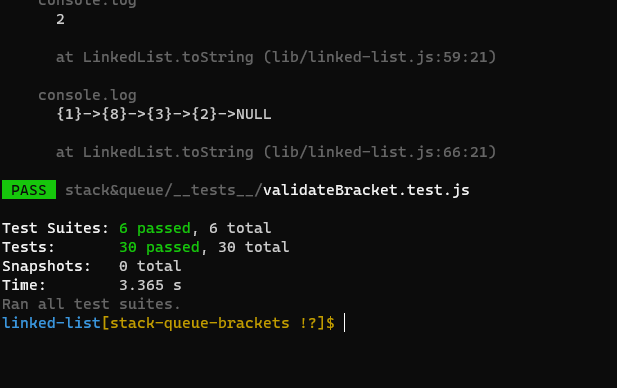
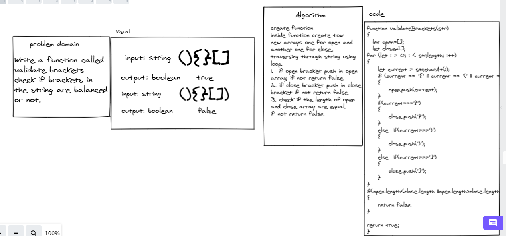

## Challenge

Write a function called
validate brackets
check if brackets in 
the string are balanced
or not.

**Validate Brackets**

Arguments: string

Return: boolean

representing whether or not the brackets in the string are balanced

# Test

**test npm run test**

# white Boarde

