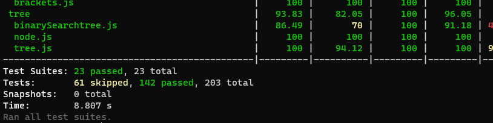
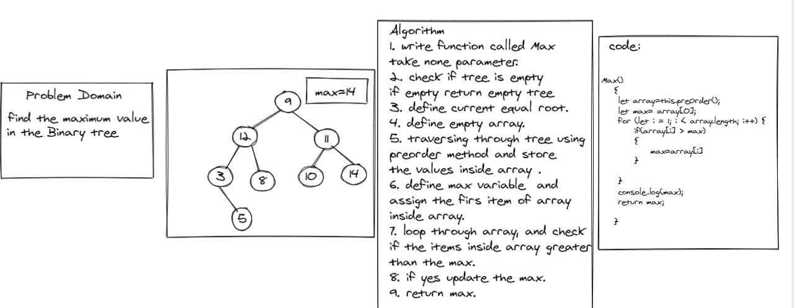

# Max

**find maximum value**

Arguments: none

Returns: number

Find the maximum value stored in the tree. You can assume that the values stored in the Binary Tree will be numeric.

# Test
 
npm run test.

#  Whiteboard Process

