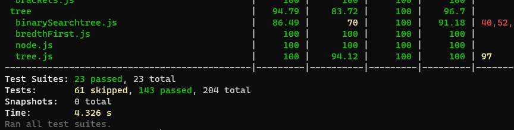
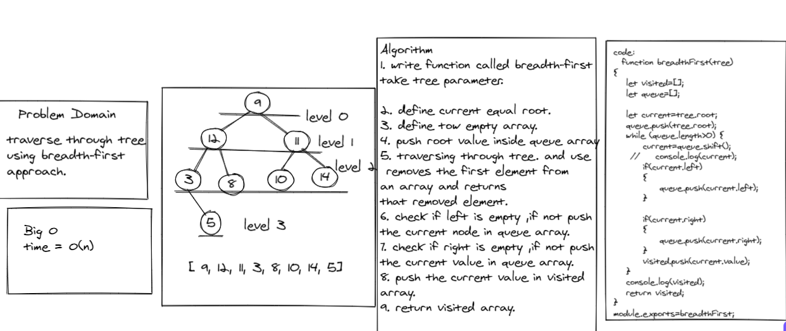

**breadth first**

Write a function called breadth first

Arguments: tree

Return: list of all values in the tree, in the order they were encountered

# Test
 
npm run test.

#  Whiteboard Process

