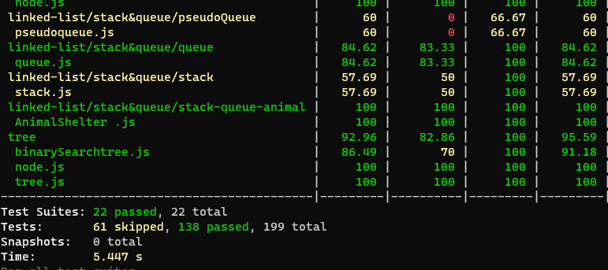
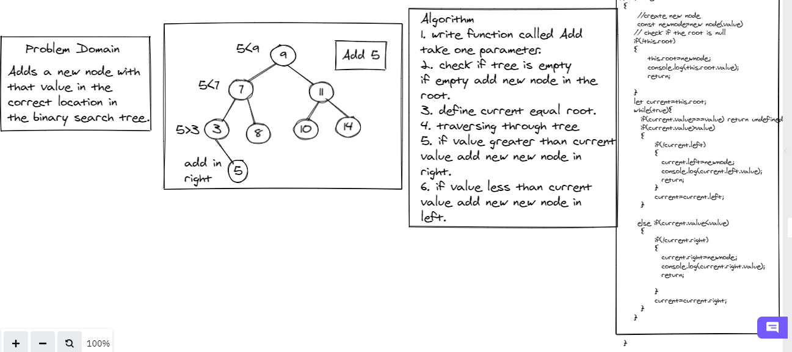

# Tree

# Node 

create class node contain:

* value
* left
* right

# Binary tree

create class Binary tree contain:

* root
* preOrder method
* postOrder method
* inOrder method

# Binary Search tree

create class Binary Search tree, sub class of Binary tree class contain:

* root
* Add method
* Contains method

**Add**

Arguments: value

Return: nothing

Adds a new node with that value in the correct location in the binary search tree.

**Contains**

Argument: value

Returns: boolean indicating whether or not the value is in the tree at least once

# Test

# Add whiteBoeard

